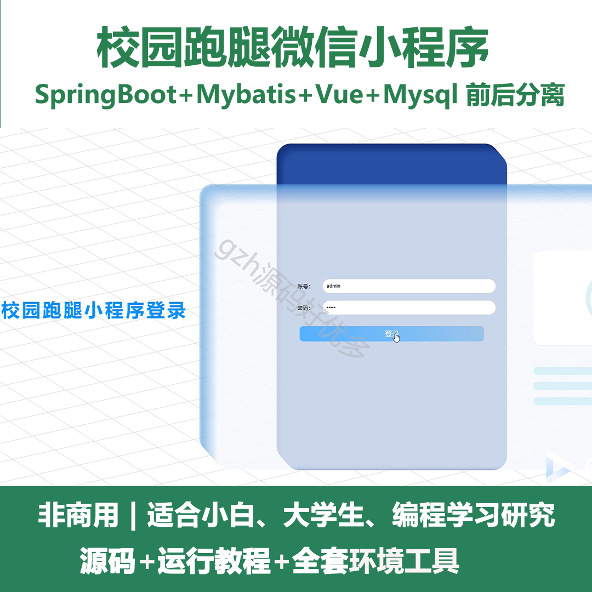
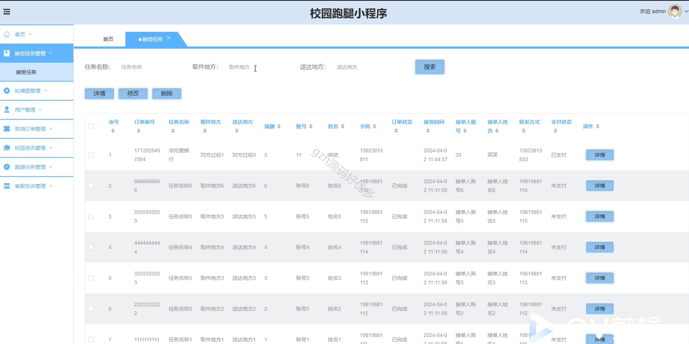
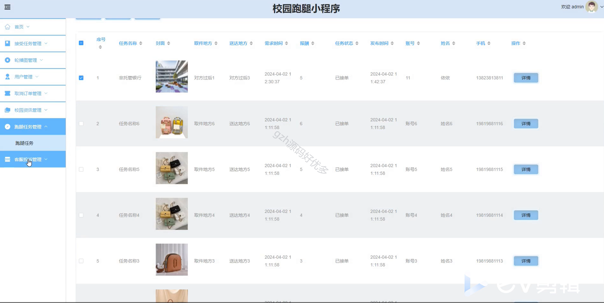
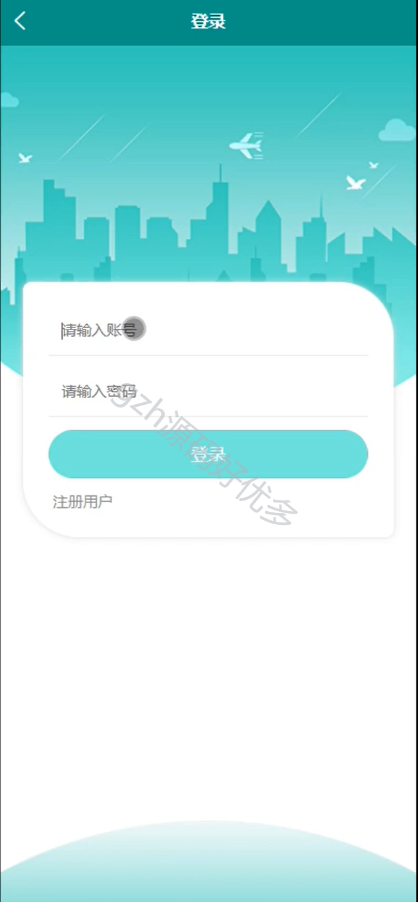
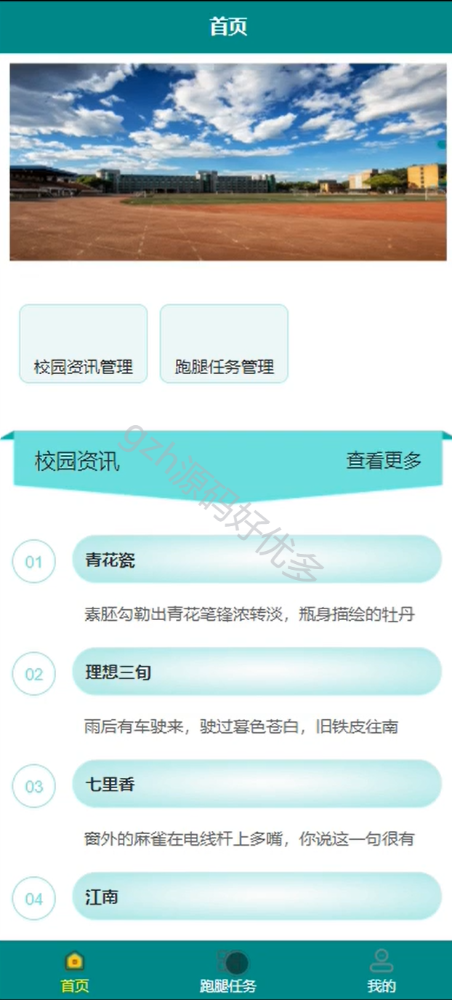
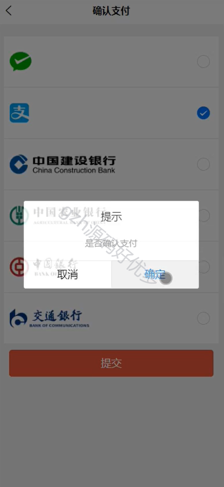
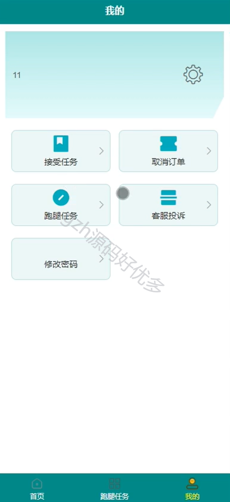
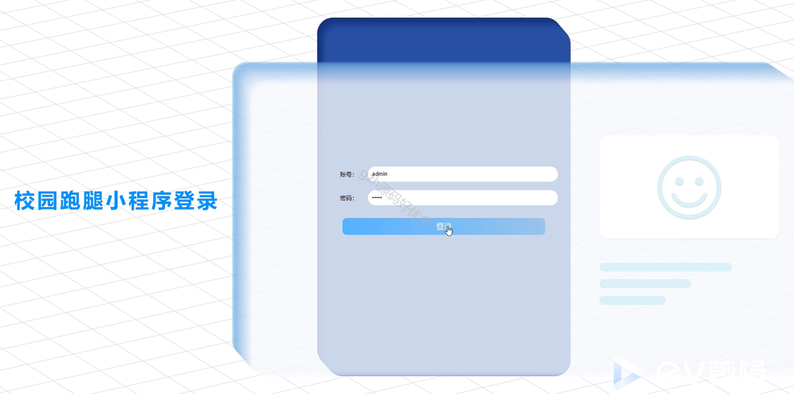

# mpweixinA060
mpweixinA060校园跑腿微信小程序Vue3（原生+unipp）
 
## 查看主页获取源码

### 一、作品包含

源码+数据库+全套环境和工具资源+部署教程

### 二、项目技术

前端技术：Html、Css、Js、Vue、Element-ui、Uniapp

数据库：MySQL

后端技术：Java、Spring Boot、MyBatis

  

### 三、运行环境

开发工具：IDEA/eclipse + HBuilderX + 微信开发者工具

数据库：MySQL5.7

数据库管理工具：Navicat10以上版本

环境配置软件： JDK1.8+Maven3.6.3

前端Nodejs：16

### 四、项目介绍
项目编号：mpweixinA060

本项目是一个基于Spring Boot和微信小程序开发的校园跑腿小程序，旨在为广大学生提供便捷、高效的校园代办服务。通过该平台，用户可以发布各种跑腿需求，如代买物品、送餐取件、文具采购等，而服务人员则可以接单并完成任务。该项目不仅提高了校园生活的便捷性，也促进了校园社区的互动与协作，满足了现代学生对高效服务的需求。

### 五、运行截图

  
